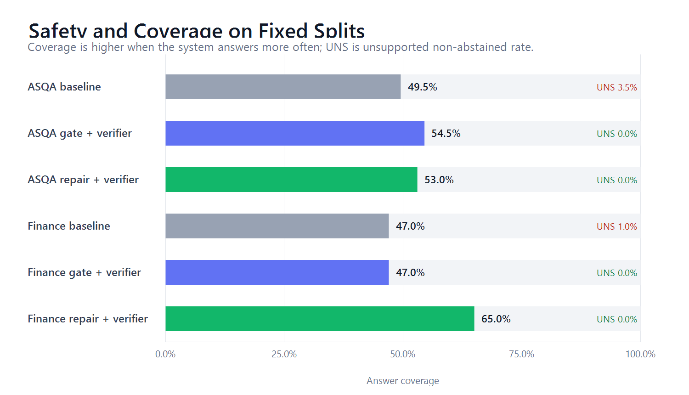
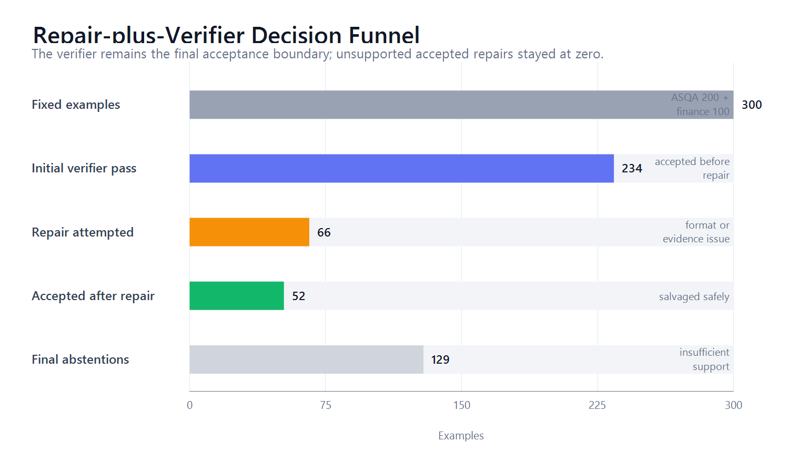
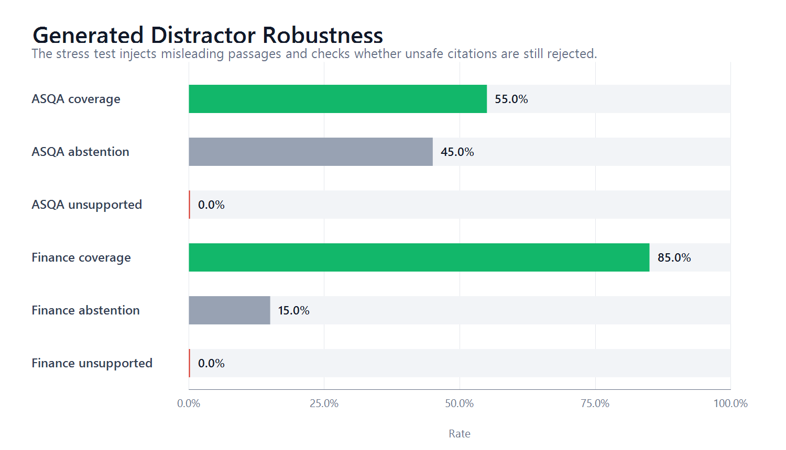

# Verifier-Bounded Repair for Safer Retrieval-Augmented Generation

**Group member:** Mehmet Can Ozen  
**Student ID:** 20210808020  
**Repository:** <https://github.com/mehmetcanozen/llmtermproject>

## Abstract

Retrieval-augmented generation (RAG) systems can produce answers with citations that appear authoritative even when the cited passage does not support the claim. This project builds a local citation-grounded RAG pipeline and evaluates whether deterministic verification plus one-step evidence-only repair can improve useful answer coverage without accepting unsupported citations. The system compares a deterministic baseline, an attention-gated variant, a verifier projection, and a new `repair_plus_verifier` variant. On a fixed evaluation split of 200 ASQA examples and 100 synthetic finance questions, the best 3B repair-plus-verifier system keeps unsupported non-abstained answers at 0.0%, improves finance exact-answer accuracy from 62.0% to 80.0%, and improves ASQA short-answer coverage from 26.1% under verifier projection to 33.5%. A generated distractor stress test also keeps unsupported accepted answers at 0.0%.

## Problem Definition and Motivation

RAG is commonly used to make LLM answers auditable by attaching source citations. A dangerous failure mode is citation hallucination: the model gives a fluent answer and appends a citation marker even though the cited passage does not support the claim. The original proposal targeted deterministic citation enforcement through inference-time grounding signals. The final implementation keeps that goal but shifts toward a fully reproducible local pipeline: deterministic generation, hybrid retrieval, attention-gate instrumentation, a deterministic verifier, and an evidence-only repair loop.

## Dataset / Data Source

The project uses two evaluation sources:

- ASQA as a bounded local-corpus citation task with 200 fixed evaluation examples.
- A synthetic finance dataset with 100 fixed questions over fictional disclosures.

The project also includes a generated distractor stress test in which each prompt receives one additional plausible but irrelevant fourth passage. That stress test is reported separately from the formal fixed split.

## LLM Methodology

The implementation is a local RAG pipeline. Retrieval combines dense BGE embeddings with BM25 ranking. The generator uses deterministic Qwen2.5-Instruct models. Every factual sentence must end with citation markers such as `[P1]`.

The compared systems are:

- `baseline`: deterministic RAG generation with required citations.
- `gate_only`: baseline plus passage-directed attention tracing and an abstention gate.
- `gate_plus_verifier`: gate outputs projected through deterministic verifier rejection.
- `repair_plus_verifier`: generate, verify, attempt one evidence-only repair if needed, verify again, and otherwise abstain.

The verifier is the final acceptance boundary. For finance, it checks company, period, metric, numeric value, and expected cited passage. For ASQA, it checks citation structure, cited-passage existence, explicit anchors, and short-answer coverage. If verification fails after repair, the system outputs `INSUFFICIENT_SUPPORT`.

## Experiments and Results

### Fixed Split

| System | Dataset | N | Coverage | Unsupported Non-Abstained | Abstention |
| --- | --- | ---: | ---: | ---: | ---: |
| Baseline 3B | ASQA | 200 | 49.5% | 3.5% | 47.0% |
| Gate-only 3B | ASQA | 200 | 54.5% | 2.5% | 43.0% |
| Gate+Verifier 3B | ASQA | 200 | 54.5% | 0.0% | 45.5% |
| Repair+Verifier 3B | ASQA | 200 | 53.0% | 0.0% | 47.0% |
| Repair+Verifier 7B | ASQA | 200 | 42.5% | 0.0% | 57.5% |
| Baseline 3B | Finance | 100 | 47.0% | 1.0% | 52.0% |
| Gate+Verifier 3B | Finance | 100 | 47.0% | 0.0% | 53.0% |
| Repair+Verifier 3B | Finance | 100 | 65.0% | 0.0% | 35.0% |
| Repair+Verifier 7B | Finance | 100 | 0.0% | 0.0% | 100.0% |

*Figure 1. Fixed-split safety and coverage. Green repair-plus-verifier rows keep unsupported non-abstained output at 0.0% while improving the strongest utility metrics.*

The best system is repair-plus-verifier 3B. Compared with gate-plus-verifier, finance exact accuracy improves from 62.0% to 80.0%, finance answer coverage improves from 47.0% to 65.0%, and abstention decreases from 53.0% to 35.0%. On ASQA, answer coverage remains close to verifier projection, while short-answer coverage improves from 26.1% to 33.5%.

### Repair Salvage

| Dataset | Model | Repair Attempts | Accepted Repairs | Salvage Rate | Unsupported Accepted Repairs |
| --- | --- | ---: | ---: | ---: | ---: |
| ASQA | 3B | 24 | 11 | 45.8% | 0 |
| ASQA | 7B | 49 | 11 | 22.4% | 0 |
| Finance | 3B | 42 | 41 | 97.6% | 0 |
| Finance | 7B | 59 | 44 | 74.6% | 0 |

*Figure 2. Repair-plus-verifier decision funnel. The verifier remains the final acceptance boundary, and unsupported accepted repairs remained zero.*

### Generated Distractor Stress Test

| Dataset | N | Coverage | Exact Accuracy | Unsupported Non-Abstained | Abstention |
| --- | ---: | ---: | ---: | ---: | ---: |
| ASQA | 40 | 55.0% | - | 0.0% | 45.0% |
| Finance | 20 | 85.0% | 85.0% | 0.0% | 15.0% |

The generated distractor stress test adds a fourth irrelevant passage. Repair-plus-verifier 3B remains robust: both datasets keep unsupported non-abstained answers at 0.0%.

*Figure 3. Generated distractor robustness. The stress slice adds plausible irrelevant passages and keeps unsupported non-abstained answers at 0.0%.*

## Discussion and Limitations

The strongest conclusion is narrow but useful. Verifier-bounded repair improves answer usefulness while preserving citation safety in this local setup. However, the ASQA verifier is a deterministic proxy rather than a human factuality audit. It checks citation structure and explicit anchors, but it does not prove complete semantic faithfulness. The finance dataset is synthetic, so it is a controlled stress test rather than real financial evidence. The 7B repair model was also much more conservative than 3B, especially on finance, where it abstained on all fixed examples.

## Conclusion

This project demonstrates a practical pattern for safer local RAG. A deterministic verifier can turn unsupported cited answers into explicit abstentions, and a one-step evidence-only repair loop can recover some supported answers without weakening that safety boundary. The best 3B repair-plus-verifier system achieves 0.0% unsupported accepted answers on the fixed split, improves finance exact accuracy by 18 percentage points, and remains safe under a generated distractor stress test.

## References

- Patrick Lewis et al., "Retrieval-Augmented Generation for Knowledge-Intensive NLP Tasks," NeurIPS, 2020.
- Ivan Stelmakh et al., "ASQA: Factoid Questions Meet Long-Form Answers," EMNLP, 2022.
- Tianyu Gao et al., "Enabling Large Language Models to Generate Text with Citations," EMNLP, 2023.
- Sarthak Jain and Byron C. Wallace, "Attention is not Explanation," NAACL, 2019.
- Sarah Wiegreffe and Yuval Pinter, "Attention is not not Explanation," EMNLP-IJCNLP, 2019.
- Qwen Team, Qwen2.5 model cards and technical reports, 2024.
